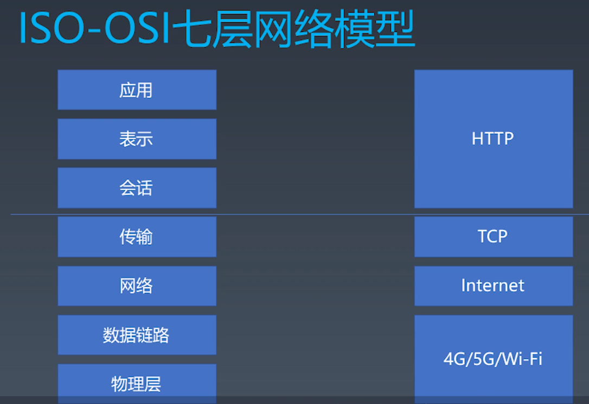

# 状态机 | 有限状态机
## 有限状态机

1. 每一个状态都是一个机器
    + 在每一个机器里，我们可以做计算，存储，输出
    + 所有的这些机器接受的输入是一致的
    + 状态机的每一个机器本身没有状态，如果我们用函数来表示的话，它应该是纯函数（无副作用）
2. 每一个机器知道下一个状态
   + 每个机器都有确定的下一个状态（Moore）
   + 每个机器根据输入决定下一个状态（Mealy）

## js中有限状态机（Mealy）
```
// 每个函数就是一个状态
function state(input){  // 函数参数就是输入 
   // 在函数中可以自由地编写代码
   return next; // 返回值作为下一个状态
}

//函数调用 
while(input){
  // 获取输入 
  state = state(input) // 把状态机的返回值作为下一个状态
}
```


# 状态机 | 使用状态机处理字符串

在js中使用函数实现状态机是一种很好的方式

找到子串abcde

end状态是一个track  
reComsume

``` 
function match(string){
  let state = start;
  for(let c of string){
    state === end
  }
}

function start(c){
  if(c==='a'){
    return foundA
  }else{
    return start
  }
}

function end(c){
  return end
}


function foundA(c){
  if(c==="b"){
    return foundB
  }else{
    return start(c)
  }
}

function foundB(c){
  if(c==="c"){
    return foundC
  }else{
    return start(c)
  }
}

function foundC(c){
  if(c==="d"){
    return foundD
  }else{
    return start(c)
  }
}

function foundD(c){
  if(c==="e"){
    return foundE
  }else{
    return start(c)
  }
}

function foundD(c){
  if(c==="f"){
    return end
  }else{
    return start(c)
  }
}
```

# 浏览器




## HTTP
由Request 和 Response 组成 TCP是全双工的

服务端环境搭建

```
const http = require('http')

http.createServer((request,response)=>{
  let body = []
  request.on('error',err=>{
    console.log(err)
  }).on('data',chunk=>{
    body.push(chunk.toString())
  }).on('end',()=>{
    body = Buffer.concat(body).toString()
    console.log("body:",body)
    response.writeHead(200,{'Content-Type':'text/html'})
    response.end('Hello World\n')
  })
}).listen(8000)

console.log("server started")
```

POST/HTTP/1.1                                   Requse line
Host: 127.0.0.1
Content-Type:application/x-www-form-urlencoded  headers


# 实现一个http请求

先从它的使用的角度进行API的设计 
```
void async function  (){
  let request = new Request({
    method:'POST',
    host:'127.0.0.1',
    port:"8088",
    headers:{
      ["X-Foo2"]:"customed"
    },
    body:{
      name:'winter'
    }
  })

  let response  =await request.send()

  console.log(response)
}()
```


第一步 HTTP请求的总结
+ 设计一个HTTP请求的类
+ content-type 是一个必要的字段，要有默认值
+ body是kv格式
+ 不同的content-type影响body的格式 


第二步send函数总结

+ 在Request的构造器中收集必要的信息
+ 设计一个send函数把请求真实发送到服务kkd
+ send函数应该是异步的  返回的是一个Promise

第三步发送请求
+ 设计支持已经有的connection 或者新建connection
+ 收到数据传给的parser
+ 根据parser的状态resolve Promise


第四步ResponseParser总结
+ Response 必须分段构造 所以我们要用一个ResponseParser来装配
+ ResponseParser分段处理ResponseText 我们用状态机来分析文本结构


第五步  BodyParser总结
+ Response的body可能根据Content-Type有不同的结构 ，因此我们会采用Parser的结构来解决问题
+ 以TrunkedBodyParser为例，我们同样用状态机来处理body的格式